import { Head, Appear, Image } from 'mdx-deck'
import { Split, SplitRight } from 'mdx-deck/layouts'

import { FullScreenBackground, Title, Quote, FullScreen } from './components'
import { colors, fontSize } from './theme'
export { default as theme } from './theme'

<Head>
  <title>Better, faster, stronger teams with GraphQL by @peggyrayzis (WebDirections 2018)</title>
  <link href="https://fonts.googleapis.com/css?family=Heebo:300,800" rel="stylesheet"/>
  <link rel="shortcut icon" href="favicon.ico"/>
</Head>

<FullScreenBackground src="./img/daft-punk-fullscreen.png">
  <div style={{display: 'flex', flexDirection: 'column', alignItems: 'flex-start'}}>
    <h1 style={{fontSize: '3em', color: colors.lightBlue, margin: 0, letterSpacing: '2px', textShadow: '3px 3px grey'}}>{`How to build`}</h1>
    <h1 style={{fontSize: '3em', color: colors.white, margin: 0, letterSpacing: '2px', textShadow: '3px 3px grey'}}>{`better, faster, stronger`}</h1>
    <h1 style={{fontSize: '3em', color: colors.lightBlue, margin: 0, letterSpacing: '2px', textShadow: '3px 3px grey'}}>{`teams with GraphQL`}</h1>
    <h1 style={{fontSize: '2em', color: colors.white, margin: 0, letterSpacing: '2px', textShadow: '3px 3px grey'}}>{`@peggyrayzis`}</h1>
  </div>
</FullScreenBackground>

---
export default Split

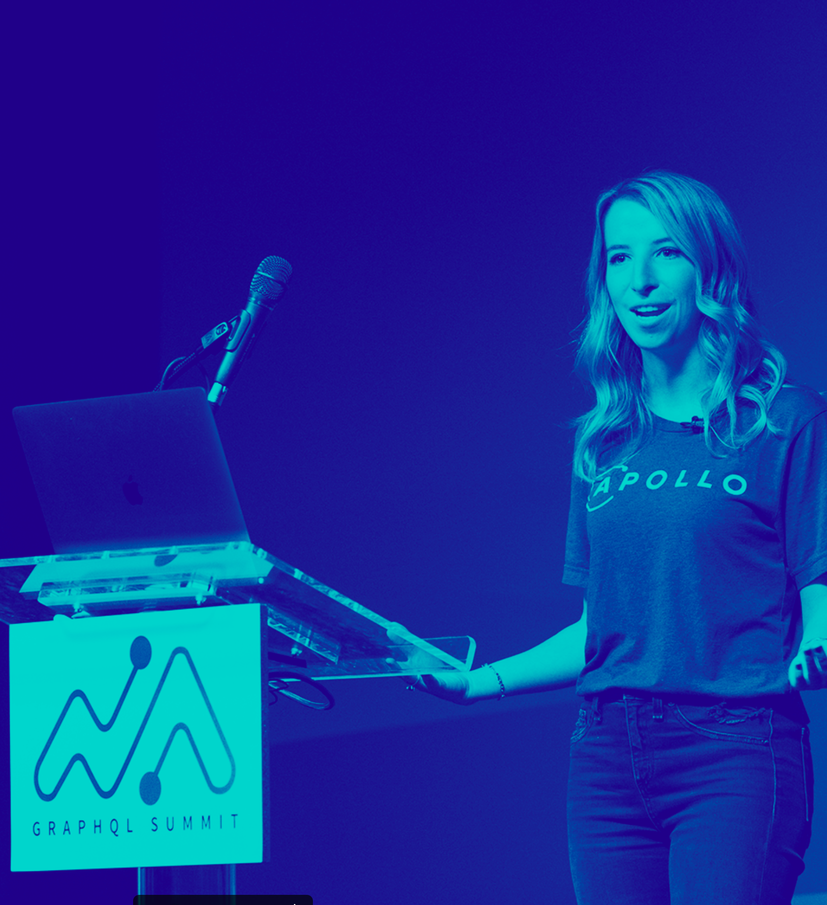

# Hi, I'm Peggy! 👋

## Engineering Manager

## @peggyrayzis

---

# GraphQL is taking<br/>the industry by storm.


```notes
- today we're here to talk about graphql and what it can do for your team
- maybe you've started evaluating it or maybe you're uncertain of what it is but one thing is for sure: it's here to stay
- over the past year, graphql adoption has increased significantly
```

---

<Image src='./img/companies.png' />

```notes
- all of these companies - companies like airbnb, github, and the new york times - are all running graphql in production.
- what's cool about graphql is that companies from a diverse range of industries, from ecommerce to social media and fintech companies are all seeing value in graphql
- this isn't just because everyone is trying to hop on the newest trendy tech, it's because graphql solves real problems engineering teams face every day
```

---

## Our apps have complex data requirements

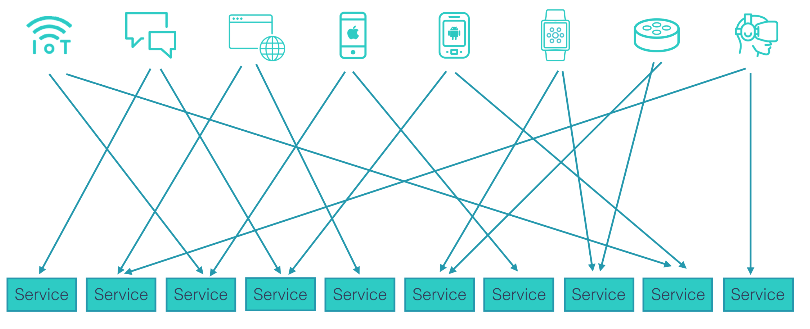

```notes
- I think the biggest problem we face when building an app is the data layer.
- Our apps have a bunch of different sources we have to pull data from, we have to sort it and filter it to make sure it's displayed in the right way
- we also have a bunch of different clients we have to support from web to mobile to iot to chatbots
- so the data requirements for our apps end up being extremely complex
```

---

<Image src="./img/twitter.png" />

```notes
- let's take twitter as an example. here's a screenshot from my feed.
```

---

<Image src="./img/twitter-markup.png" />

```notes
- i'd be willing to bet that all of these boxes i've outlined here are all pulling from different APIs in order to display the data on one page
- we have user info, a list of trending topics, a newsfeed, search
- when you have a bunch of different sources like this that you need to pull data from in a microservice architecture, or maybe you're working with a monolith and you have complex data requirements,
- whatever your situation, if you're working with data then graphql can help.
```

---

# What is GraphQL?
## A spec for communicating about data

```notes
- what exactly is graphql?
- in the simplest terms, it's an API specification that details how to communicate about data
- it's also extremely flexible - usually we talk about this communication in terms of the client and the server but you can also use graphql to query a client cache or even a css stylesheet
```

---

<Image size="95vw" src='./img/communication.png' />

```notes
- to keep it simple, we're going to stick with the client/server model for now.
- graphql becomes an API layer that sits in between your clients and your services
- your services describe the data they have and your clients describe the data they need
```

---

export default Split

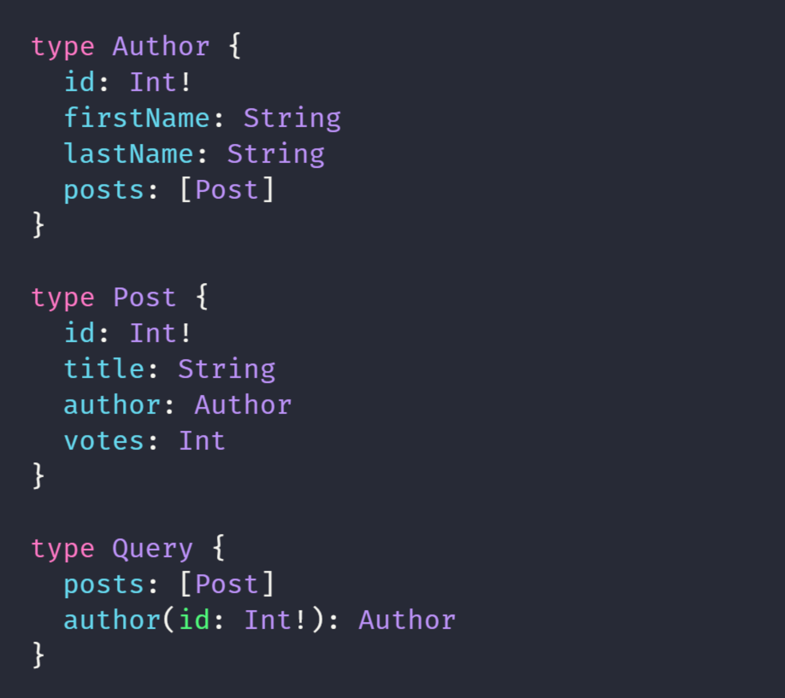

# Schema:
## Describe the data you have

```notes
- you describe what data your services have with a schema. your schema always comes first
- you can kind of think of a graphql schema almost as a blueprint or a menu for all the available data your clients can query
- your schema is strongly typed, which is why those definitions (called schema definition language) kind of looks like typescript
- as we'll see later, this static typing opens up the door to a lot of cool developer tooling
```

---

export default Split

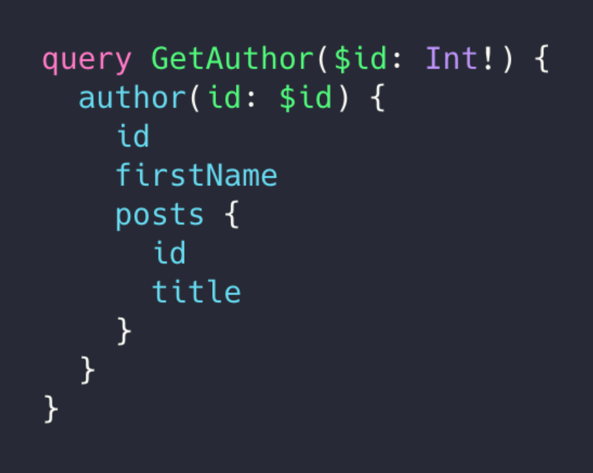

# Query:
## Describe the data you want

```notes
- once you have your schema, you describe what data you want to retrieve from your schema with queries
- you can think of queries as get requests. there are also mutations which are like post requests and subscriptions which are real time events
- to continue the restaurant analogy, if your schema is a menu then queries are how you place your order
```

---

# Resolvers turn<br/>queries into data

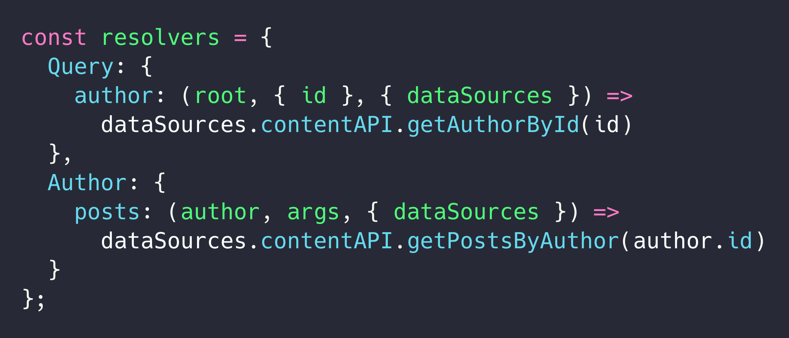

```notes
- finally, you have resolvers. they're functions that transform queries into data
- you can think of a graphql query as a tree of function calls
- so in this example, first we call the resolver for the author query and then we call the resolver for the posts field
- if your schema is a menu and queries are how you place an order, then resolvers are like the chefs in the kitchen cooking your order
- and resolvers are where you perform any data fetching from a rest api or database
```

---

<Image size="95vw" src='./img/annotated-playground.png' />

```notes
- here's what that looks like all together. this is a real shot from graphql playground, which you get for free when you build a graphql api
- on the right we have our schema, which has automated documentation for free thanks to its static typing. here we can explore all types
- on the left, we have our query. graphql is great because it enforces predictable results. the shape of the query is always what we are going to get back
- finally, resolvers turn our query into data. the response shape always matches the request
```

---

# With GraphQL, you always<br/>receive exactly what<br/>you asked for.
## Smaller payloads = faster apps ⚡️

```notes
- not only does graphql's predictability enforce consistent results, it also leads to smaller payloads and fewer round trips
- each query has exactly one response and the size of the response is dictated by what you ask for. you always receive exactly what you ask for, nothing more or less
- these smaller payloads are a huge win for consumers on mobile devices with a slow internet connection since they don't have to parse a huge response
```

---

<Image size="95vw" src='./img/rest-payload.png' />

```notes
- just how noticeable is that difference? here we have a rest api detailing all the launch information for space x launches
- this resource alone sends nearly 35 kilobytes of json
- it's highly likely that we won't need all of these fields exposed on the client when we're building our app. let's see how we can do better with graphql
```

---

<Image size="95vw" src='./img/gql-payload.png' />

```notes
- by layering a graphql api over this rest endpoint, all we have to do is pick out the specific fields that we want to use on the client
- this reduces our payload down to 1.3 kilobytes, which is a huge improvement
- i think some people might be critical and say you can already use rest selectors to accomplish this
- but i'd ask, if you're putting a lot of effort to make your rest endpoint behave in a way that you already get with graphql for free, then it's probably a sign you need graphql
```

---

export default Split


# I don't want to<br/>rewrite all my<br/>REST APIs!

```notes
- if you already have a lot of REST APIs, you're probably feeling like this grumpy turtle right about now.
- i'm actually getting my diving license at the great barrier reef this weekend so i'm excited to meet this turtle so i can convince him
- you don't have to rewrite all your rest apis to get started with graphql!
- this is a common misconception, which is proliferated by all the graphql vs. rest hype train articles you read on hacker news
```

---

export default SplitRight

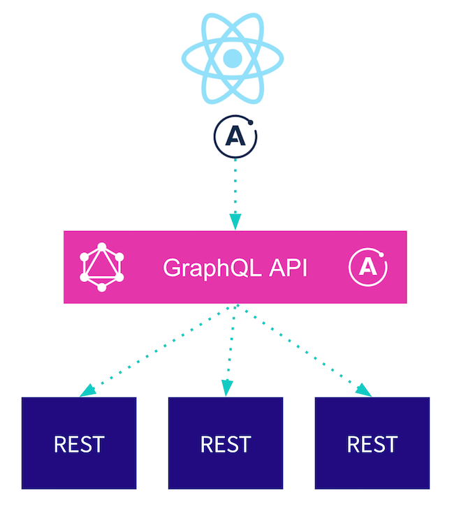

# Good news:
## Layering a graph API over REST can help you migrate incrementally.

```notes
- in fact, graphql works great with the APIs you already have. it's a complement to REST.
- layering a graph API over your REST endpoints one by one is actually our recommended way to get started since it helps you migrate incrementally
- you may be asking yourself, how exactly do i do that?
```

---

<FullScreenBackground src="./img/background.jpg">
  <div style={{display: 'flex', flexDirection: 'column', alignItems: 'center'}}>
    
    <Title style={{margin: 0}}>The graph API platform</Title>
  </div>
</FullScreenBackground>

```notes
- and that's where Apollo comes in! Apollo is a complete platform for layering a graph API over your existing data
- you can say that Apollo is a specific way to implement GraphQL.
```

---

<FullScreenBackground src="./img/background.jpg">
  <div style={{display: 'flex', flexDirection: 'column', alignItems: 'center'}}>
    
    <ul style={{margin: '20px', fontSize: '2em', color: colors.white}}>
      <li style={{textAlign: 'left'}}>Two open source libraries: Apollo Server & Client 🚀</li>
      <li style={{textAlign: 'left'}}>Developer tooling that fits your workflow 🛠</li>
      <li style={{textAlign: 'left'}}>Designed to help your team follow best practices 🙌</li>
    </ul>
  </div>
</FullScreenBackground>

```notes
- what does that entail?
- we have two open source libraries, apollo server and apollo client which are both the most popular graphql client and server in the ecosystem today
- apollo also comes with developer tooling powered by our cloud service Apollo Engine that helps developers be productive with GraphQL
- this tooling meets developers where they are today - so we have a VSCode extension, a Chrome extension, and integrations for GitHub, Slack, Datadog, and more
- apollo also enforces a consistent set of best practices to help you get the most out of graphql
- lets see what this looks like in practice
```

---

export default Split

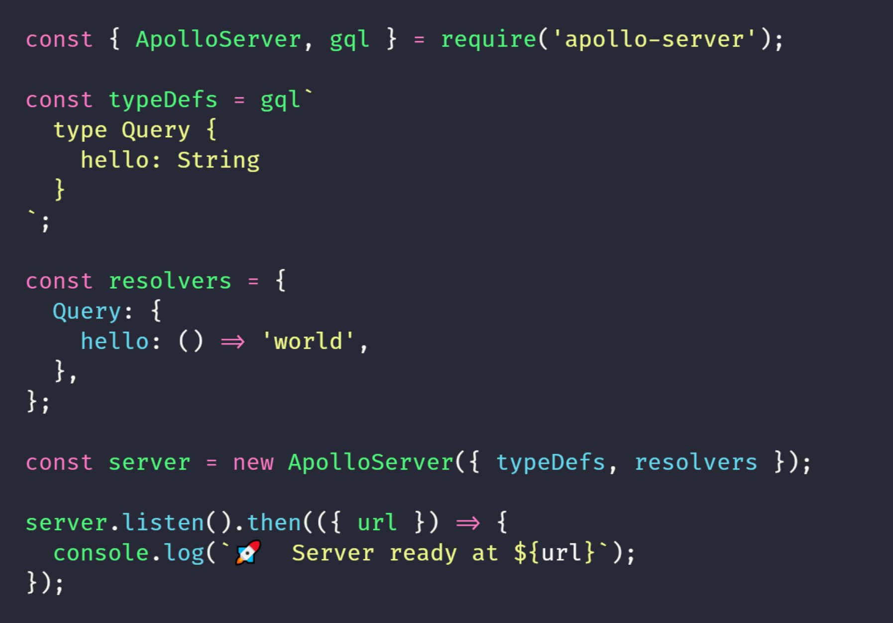

# Apollo Server:
<ul style={{margin: '20px', fontSize: '1.5em'}}>
  <li style={{textAlign: 'left'}}>Schema first server with batteries included 🚀</li>
  <li style={{textAlign: 'left'}}>Includes GraphQL Playground, schema stitching, subscriptions, mocking, persisted queries, and more!</li>
</ul>

---

export default Split

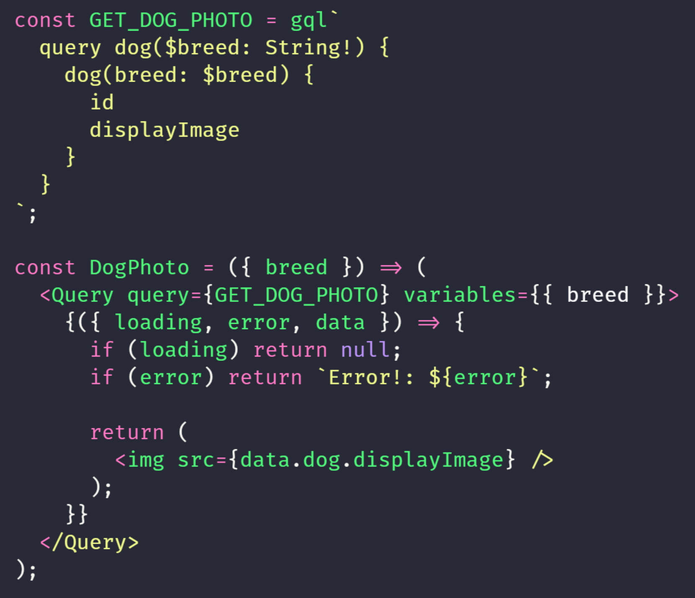

# Apollo Client:
<ul style={{margin: '20px', fontSize: '1.5em'}}>
  <li style={{textAlign: 'left'}}>Declarative data fetching for React, Angular, Vue, and vanilla JS</li>
  <li style={{textAlign: 'left'}}>You get intelligent caching, loading & error state tracking, optimistic UI, SSR support out of the box</li>
</ul>

---

<Image src="./img/platform.png" />

```notes
- when you put it all together, it looks something like this.
- we have our apollo server that sits on top of our rest apis, databases, grpc services, whatever data you have
- this server connects to apollo engine, our cloud service that registers your schema and provides detailed analytics to our developer tooling
- finally, you have apollo client, which allows you to query graphql from any client, including iOS and Android and anywhere javascript is run
```

---

# Full insight into your graph

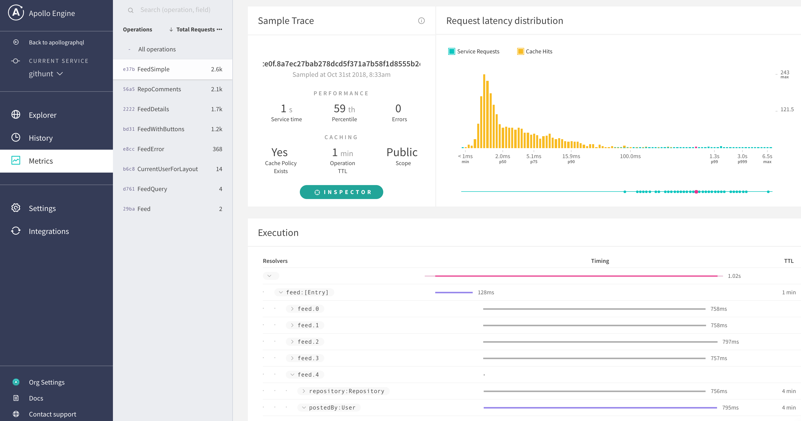

```notes
- once you register your schema with apollo engine, you'll unlock detailed metrics that give you visibility into the performance of your graph and how it's being used
- i want to be completely transparent that while most of our tools are open source and free to use, viewing these detailed metrics is a paid service simply because it takes a lot of infrastructure to power this and also teams find it incredibly valuable
- engine collects detailed metrics on how you're using your schema, which clients are querying certain fields, and cache hits. all of this data is then piped into our developer tooling
```

---

export default Split

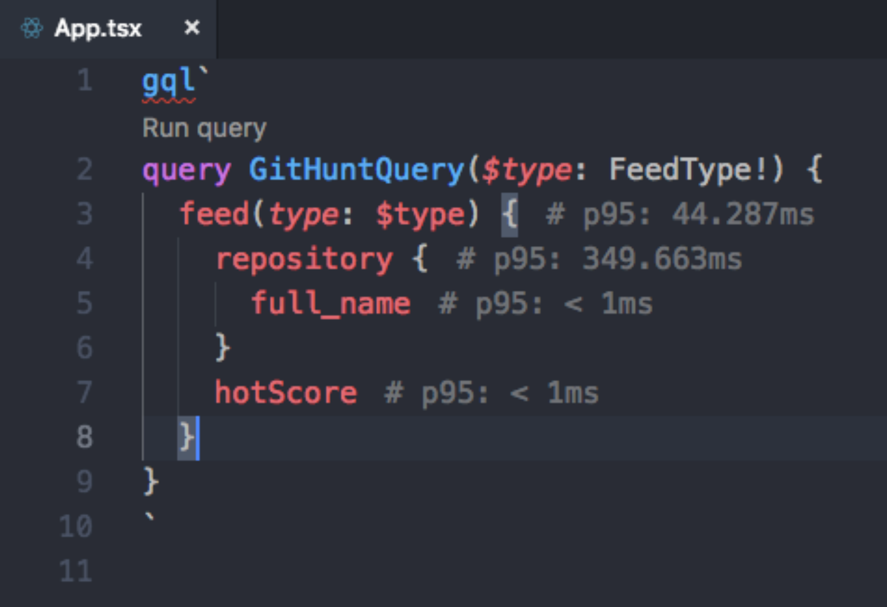

# Apollo VSCode
## Realtime metrics inside your editor empowers developers to write better code

```notes
- like vscode, which will actually show you the performance metrics of your query as you're typing it into your editor.
- apollo vscode also enables useful features like autocomplete and jump to schema definitions to help you be more productive and write better code
- it's super important to have these metrics in order for you to understand what's going on with your graph
```

---

<FullScreenBackground src="./img/npm-stats.png">
  <h1 style={{color: colors.black, fontSize: fontSize.large}}>
    Apollo has grown 400%<br/>in the past year.
  </h1>
</FullScreenBackground>

---

<FullScreenBackground src="./img/background.jpg">
  <h1 style={{color: colors.white, fontSize: fontSize.large}}>
    Apollo helps developers<br/>succeed by lowering the barriers<br/>to building great apps.
  </h1>
</FullScreenBackground>

---

<Quote
  quote="I'm a new frontend developer and our team at code school decided to learn GraphQL and deploy an app using Apollo in 2 weeks for our final project."
  author="Chad Whitaker (@tchadwhitaker), Momentum Learning"
/>

---

<Quote
  quote="Once you move to Apollo to handle data over the network, it becomes much harder to justify loading a library like Redux for local state management. Apollo fills that need perfectly."
  author="Adam Neary (@AdamRNeary), Airbnb"
/>

---

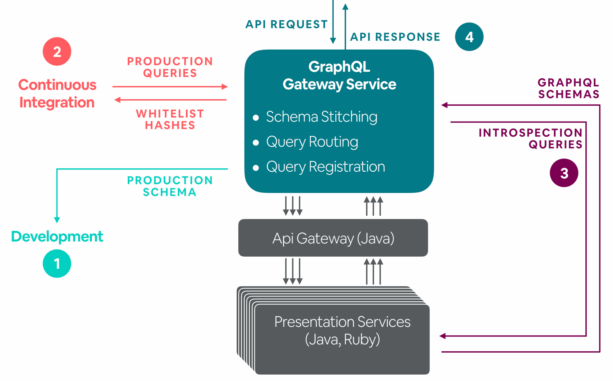

["Reconciling GraphQL and Thrift at Airbnb" by Adam Neary](https://medium.com/airbnb-engineering/reconciling-graphql-and-thrift-at-airbnb-a97e8d290712)

---

<Quote
  quote="Apollo’s REST data source has become an invaluable piece in building a GraphQL service that fetches data from legacy API’s. It has allowed us to integrate a new REST API in minutes."
  author="Kristy Miller (@kmills006), Poetic Systems"
/>

---

# If you work with data, then GraphQL can help your team become better, faster, and stronger.

---

export default Split


# Better

## GraphQL simplifies your data layer by removing complexity from the client.

```notes
- how does graphql make your team better?
- it's hard to define what constitutes better code but i like to think of it as code that's simple
- simple code is easy to extend and easy to delete, and that's exactly what graphql gives you
```

---

<Image size="70vw" src='./img/redux-to-apollo.png' />

```notes
- with rest apis like the spacex one i showed earlier, we end up writing a lot of client side code to transform and filter the data into the shape that we want
- graphql helps remove some of that complexity by moving that data transformation logic to the server
- this has huge benefits - for one, you're not writing all that complicated redux code
- but it also makes all of that sorting and filtering logic reusable across clients
```

---

<Image size="95vw" src='./img/reusable.png' />

```notes
- by layering an apollo graph api on top of your data, you can remove complexity from the client and store it in a centralized place
- this way all clients can use it and you're not duplicating yourself
- in addition to sorting and filtering, we also recommend moving localization and computed fields into this graphql layer as well
```

---

export default Split


# Faster

## GraphQL helps you ship faster by enabling developers to write less code.

```notes
- so we've learned how graphql enables us to write better code. it also enables us to ship faster by writing less code. let's learn how that happens.
```

---

# State management is hard

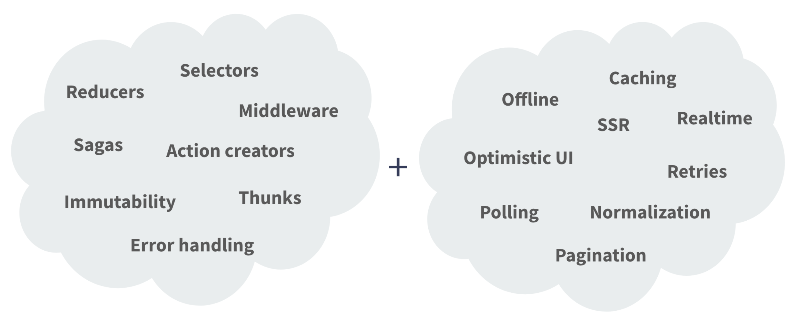

---

# Write queries, not code

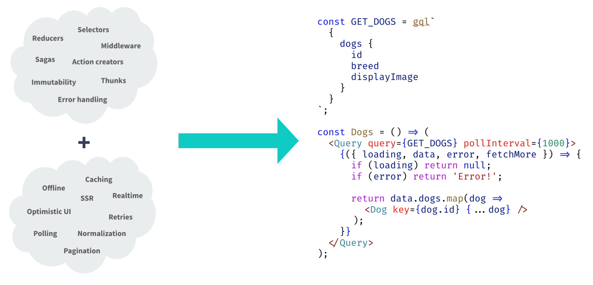

---

export default Split

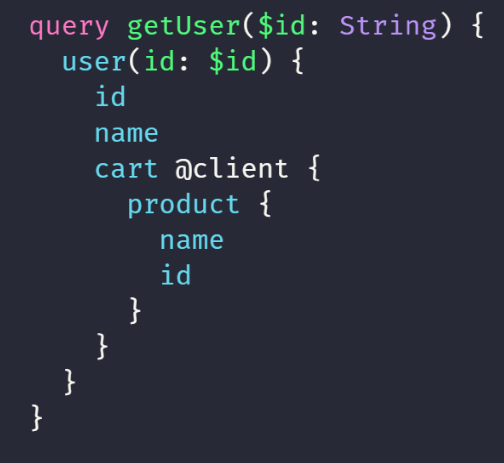

# A single source<br/>of truth

<ul style={{margin: '20px', fontSize: '1.5em'}}>
  <li style={{textAlign: 'left'}}>With Apollo, you can query local data alongside remote data</li>
  <li style={{textAlign: 'left'}}>The Apollo cache becomes your single source of truth and GraphQL becomes a unified interface to all your data</li>
</ul>
---

export default Split


# Stronger

## GraphQL makes your team stronger by helping product teams collaborate.

---

# Schema driven development

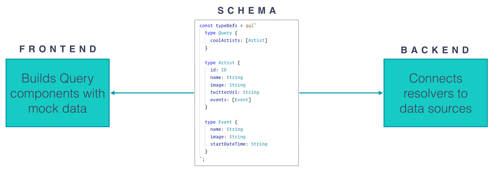

---

export default Split

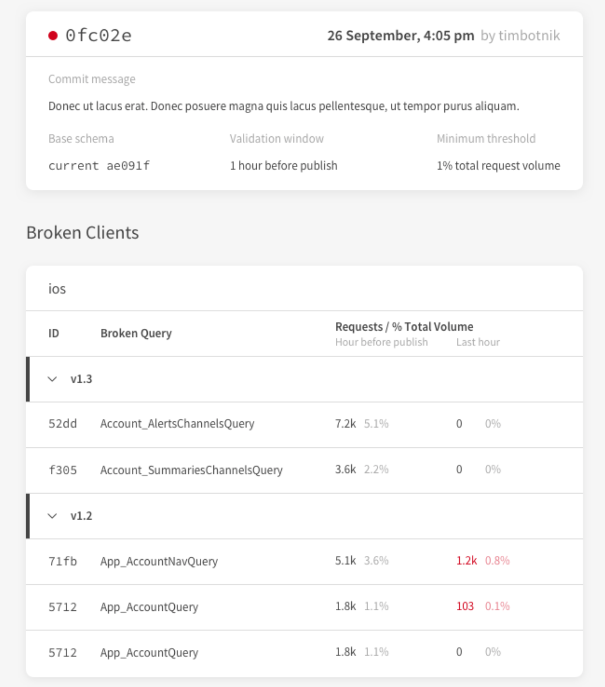

# Evolve your API safely

<ul style={{margin: '20px', fontSize: '1.5em'}}>
  <li style={{textAlign: 'left'}}>The Apollo CLI brings schema validation into your existing CI workflow</li>
  <li style={{textAlign: 'left'}}>Pinpoint if a schema change will break any clients before it happens</li>
  <li style={{textAlign: 'left'}}>Deprecate fields gracefully</li>
</ul>

---

# What are the pitfalls?
## GraphQL's flexibility makes it<br/>easy to do the wrong thing

---

# Pitfall: Performance
## n+1 problem: A query can request the same resource multiple times

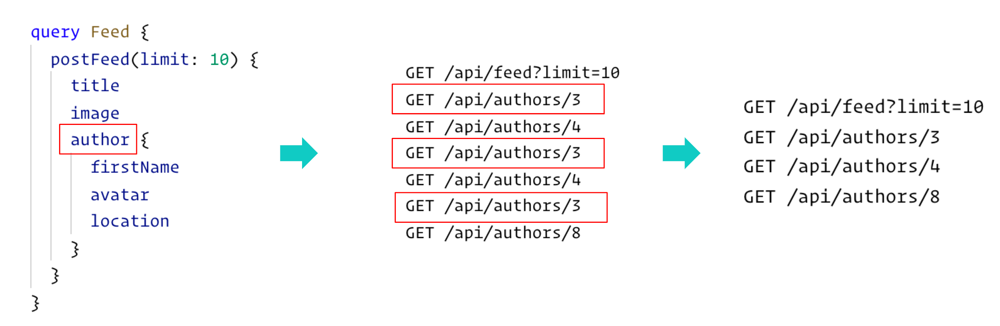

---

export default Split

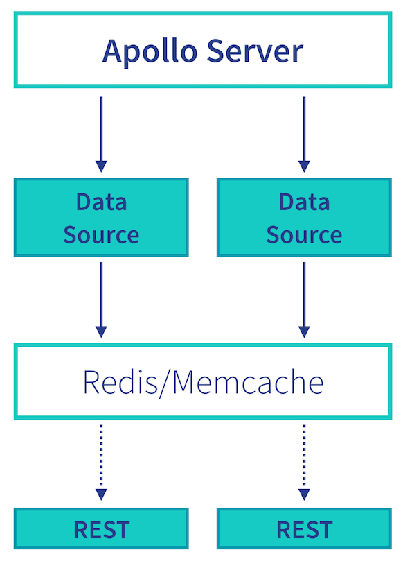

# Solution: Apollo data sources
## Apollo sets up a cache for your resources

---

export default Split

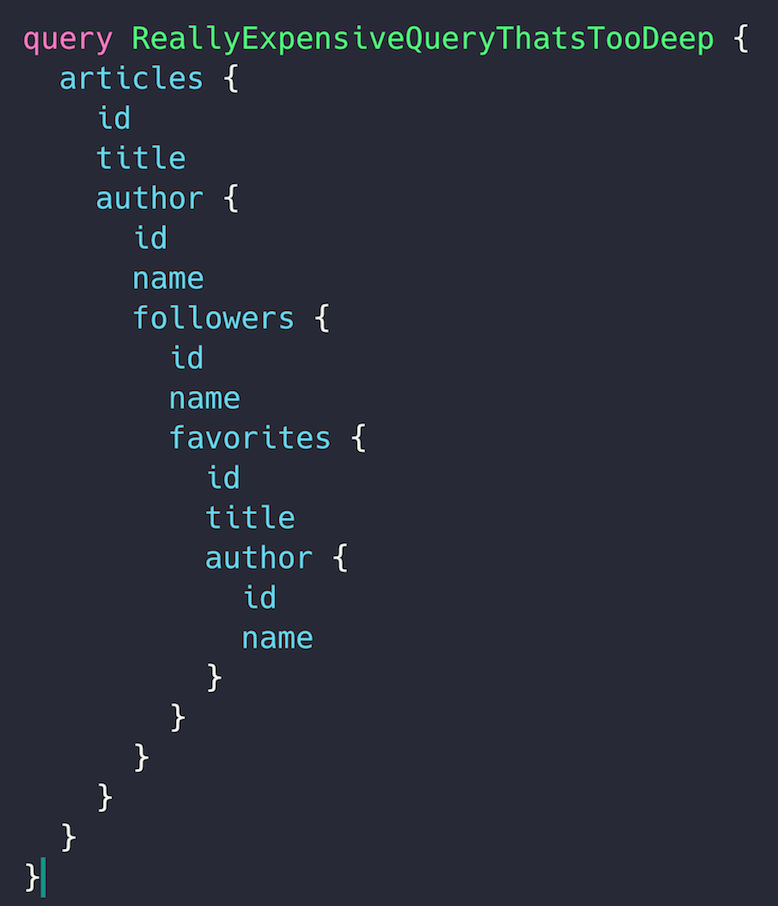

# Pitfall: Security
## GraphQL queries can have unlimited depth and complexity

---

# Solution:<br/>Apollo operation registry
## Register queries and lock down your graph

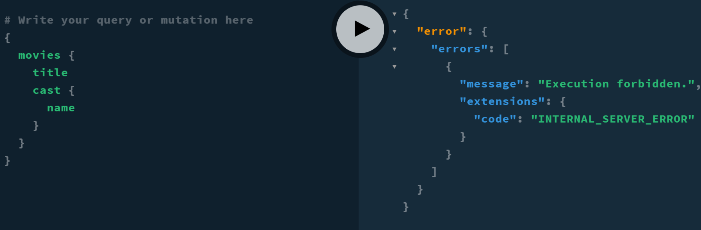

---

# How do I get started?

---

<FullScreenBackground src="./img/background.jpg">
  <Title>Demo time! 🎉</Title>
</FullScreenBackground>

---

export default SplitRight

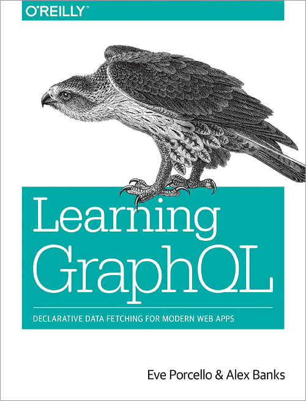

# Learning GraphQL

## Eve Porcello (@eveporcello)
## Alex Banks (@MoonTahoe)

---

export default Split

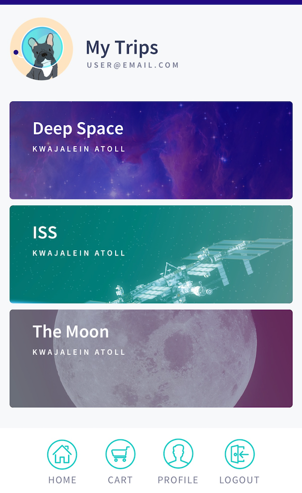

# Apollo tutorial

## Launching at<br/>apollographql.com/docs<br/>next week! 🚀

---

<FullScreenBackground src="./img/background.jpg">
  <Title style={{fontSize: '3.2em'}}>GraphQL is all about<br/>empowering developers to work<br/>better, faster, and stronger. 💪</Title>
</FullScreenBackground>

---

export default Split


# You are all koalafied to implement GraphQL! 🐨

## Start small and incrementally adopt.

---

<FullScreenBackground src="./img/daft-punk-fullscreen.png">
  <div style={{display: 'flex', flexDirection: 'column', alignItems: 'center'}}>
    <h1 style={{fontSize: '3em', color: colors.lightBlue, margin: 0, letterSpacing: '2px', textShadow: '3px 3px grey'}}>{`Thanks WebDirections! 🇦🇺`}</h1>
    <h1 style={{fontSize: '3em', color: colors.white, margin: 0, letterSpacing: '2px', textShadow: '3px 3px grey'}}>{`@peggyrayzis`}</h1>
  </div>
</FullScreenBackground>


